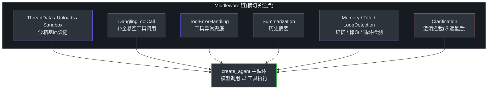
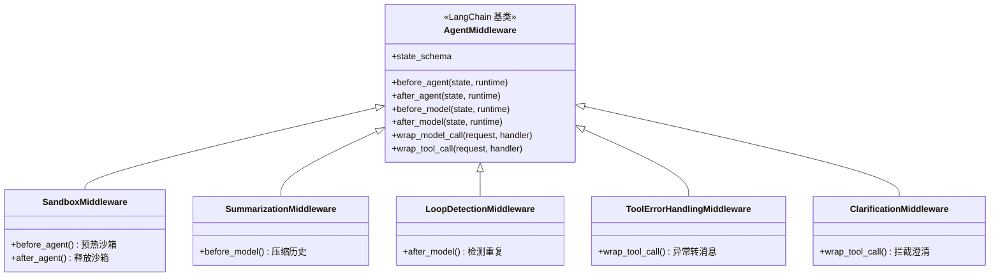
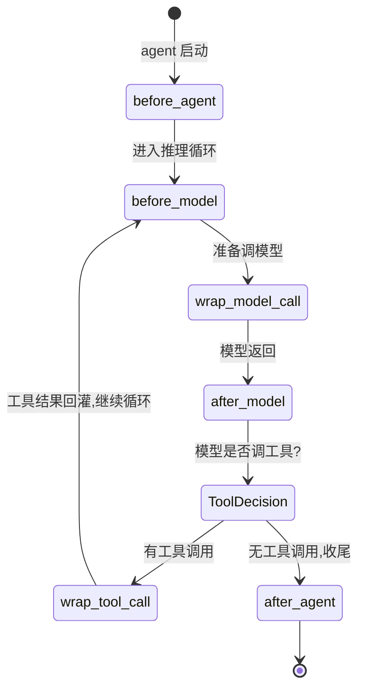
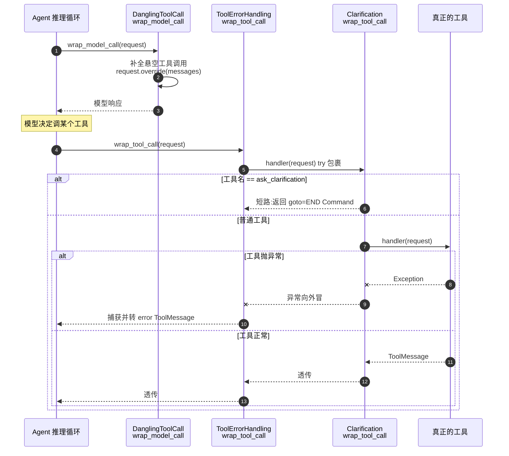
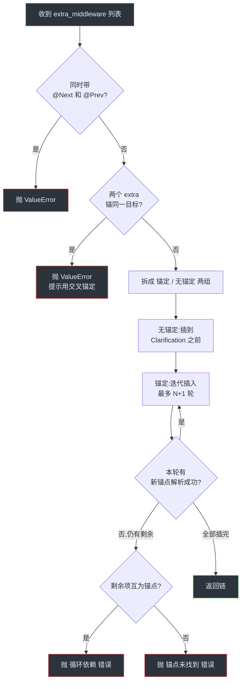

# 中间件链机制

> **本章目标**:
> 1. 理解 DeerFlow 为什么把 agent 的横切逻辑抽成 middleware,而不是直接写进 agent 主循环
> 2. 掌握 `AgentMiddleware` 的四类 hook(before/after agent、before/after model、wrap_model_call、wrap_tool_call)及"洋葱模型"执行语义
> 3. 看懂两套 middleware 串联机制——feature 驱动的固定链(`create_deerflow_agent`)与配置驱动的生产链(`make_lead_agent`),以及 `@Next`/`@Prev` 定位插入算法

## TL;DR

DeerFlow 把 agent 运行期的所有横切关注点(沙箱准备、工具报错兜底、上下文摘要、记忆写入、标题生成、循环检测、澄清拦截……)统一抽象成 `AgentMiddleware`,由 LangChain `create_agent` 在固定的生命周期点回调。middleware 之间靠"列表顺序 + 洋葱嵌套"组合:`before_*` hook 按列表正序执行,`after_*` 按逆序,`wrap_*` 则层层包裹形成洋葱。DeerFlow 提供两套装配器——`create_deerflow_agent` 用 `RuntimeFeatures` 拼一条 14 段的固定链,`make_lead_agent` 用 `AppConfig` 拼生产链;两者都靠"`ClarificationMiddleware` 永远在最后"这一不变量收尾,自定义 middleware 通过 `@Next`/`@Prev` 装饰器声明锚点插入。

## Overview(为什么要有中间件链)

一个 agent 的"主循环"本质很简单:把消息丢给模型 → 模型返回工具调用 → 执行工具 → 把结果塞回消息 → 再丢给模型,直到模型不再调用工具。难点不在这个循环,而在循环周围一圈**横切逻辑**:

- 模型调用**之前**:要不要先把过长的历史摘要掉?要不要补上当前日期、记忆片段?
- 模型调用**之后**:要不要检测它是不是陷入了重复循环?要不要顺手生成会话标题?
- 工具调用**之时**:工具抛异常了怎么办——整个 run 崩掉,还是转成一条错误消息让模型自己重试?
- 整个 agent 跑**之前/之后**:沙箱要不要预热?跑完要不要把对话刷进长期记忆?

直觉做法是把这些逻辑全写进 agent 主循环。但这样有三个致命问题:

1. **主循环爆炸**:十几个关注点全塞进一个函数,几百行 `if feature_enabled:`,改一处牵动全身。
2. **无法选择性开关**:沙箱、记忆、循环检测这些功能要能按配置独立开关。写死在主循环里,开关就是满地的条件分支。
3. **无法扩展**:第三方想插入自定义鉴权逻辑,只能改 DeerFlow 源码——没有扩展点。

DeerFlow 的答案是 **middleware 链**:把每个横切关注点封装成一个 `AgentMiddleware` 子类,agent 主循环保持极简,只在固定的生命周期点回调这串 middleware。功能开关 = 这个 middleware 在不在链里;扩展 = 往链里插一个自己的 middleware。`create_deerflow_agent` 的文档注释把这点说得很直白——它是"夹在 `langchain.agents.create_agent` 原语和配置驱动的 `make_lead_agent` 之间的 SDK 层入口"([factory.py:1-11](https://github.com/bytedance/deer-flow/blob/main/backend/packages/harness/deerflow/agents/factory.py#L1-L11))。


<!-- Sources: backend/packages/harness/deerflow/agents/factory.py:155-188, backend/packages/harness/deerflow/agents/lead_agent/agent.py:240-318 -->

## Architecture

中间件链有三个层次:**hook 抽象**(单个 middleware 能在哪些点插手)、**执行语义**(多个 middleware 如何叠加)、**装配机制**(谁来决定链里有哪些 middleware、什么顺序)。

| 层 | 职责 | 关键代码 | Source |
|---|---|---|---|
| Hook 抽象 | 定义 middleware 可重写的生命周期方法 | `AgentMiddleware`(LangChain 提供的基类) | [factory.py:18-19](https://github.com/bytedance/deer-flow/blob/main/backend/packages/harness/deerflow/agents/factory.py#L18-L19) |
| 执行语义 | `before_*` 正序、`after_*` 逆序、`wrap_*` 洋葱 | `create_agent` 内部(LangChain) | [factory.py:139-147](https://github.com/bytedance/deer-flow/blob/main/backend/packages/harness/deerflow/agents/factory.py#L139-L147) |
| Feature 装配 | 从 `RuntimeFeatures` 拼 14 段固定链 | `_assemble_from_features` | [factory.py:155-298](https://github.com/bytedance/deer-flow/blob/main/backend/packages/harness/deerflow/agents/factory.py#L155-L298) |
| 配置装配 | 从 `AppConfig` 拼生产链 | `_build_middlewares` | [lead_agent/agent.py:240-318](https://github.com/bytedance/deer-flow/blob/main/backend/packages/harness/deerflow/agents/lead_agent/agent.py#L240-L318) |
| 锚点插入 | 用 `@Next`/`@Prev` 把自定义 middleware 插进链 | `_insert_extra` | [factory.py:306-379](https://github.com/bytedance/deer-flow/blob/main/backend/packages/harness/deerflow/agents/factory.py#L306-L379) |

DeerFlow 自己**不**实现 middleware 的执行引擎——`AgentMiddleware` 基类和 hook 回调机制都来自 LangChain 的 `langchain.agents.middleware`。DeerFlow 做的是两件事:① 写了十几个具体 middleware 子类(`backend/packages/harness/deerflow/agents/middlewares/` 下);② 写了两套**装配器**决定哪些 middleware 进链、按什么顺序。


<!-- Sources: backend/packages/harness/deerflow/sandbox/middleware.py:52-68, backend/packages/harness/deerflow/agents/middlewares/summarization_middleware.py:120, backend/packages/harness/deerflow/agents/middlewares/loop_detection_middleware.py:420, backend/packages/harness/deerflow/agents/middlewares/tool_error_handling_middleware.py:39-67, backend/packages/harness/deerflow/agents/middlewares/clarification_middleware.py:158-178 -->

## Components / 核心机制

### Hook 的四种类型

`AgentMiddleware` 暴露的 hook 不是平级的,按"插手时机"分成两类语义完全不同的机制。

**第一类:点状 hook —— `before_agent` / `after_agent` / `before_model` / `after_model`**

这些是**线性回调**:在某个生命周期点上,链里每个实现了该 hook 的 middleware 被依次调用。它们接收 `(state, runtime)`,返回一个 `dict | None`——返回的 dict 会合并进 agent 的 state。典型用法:

- `SandboxMiddleware.before_agent` —— agent 开跑前预热沙箱;`after_agent` —— 跑完释放([sandbox/middleware.py:52-68](https://github.com/bytedance/deer-flow/blob/main/backend/packages/harness/deerflow/sandbox/middleware.py#L52-L68))
- `SummarizationMiddleware.before_model` —— 每次调模型前检查历史是否过长,过长就摘要([summarization_middleware.py:120](https://github.com/bytedance/deer-flow/blob/main/backend/packages/harness/deerflow/agents/middlewares/summarization_middleware.py#L120))
- `LoopDetectionMiddleware.after_model` —— 模型每次回复后检测是否陷入重复工具调用循环([loop_detection_middleware.py:420](https://github.com/bytedance/deer-flow/blob/main/backend/packages/harness/deerflow/agents/middlewares/loop_detection_middleware.py#L420))
- `MemoryMiddleware.after_agent` —— 整个 agent 跑完,把这轮对话排队写进长期记忆([memory_middleware.py:53](https://github.com/bytedance/deer-flow/blob/main/backend/packages/harness/deerflow/agents/middlewares/memory_middleware.py#L53))

每个 hook 都有同步和异步两个版本(`before_agent` / `abefore_agent`),DeerFlow 的 middleware 普遍两个都实现,以适配 LangGraph 的同步与异步执行路径。

**第二类:包裹 hook —— `wrap_model_call` / `wrap_tool_call`**

这两个 hook 不是"在某点被调一下",而是**拿到下一层的 `handler`,自己决定调不调、怎么调、调完怎么处理**。这是真正的"洋葱模型"——见下一节。


<!-- Sources: backend/packages/harness/deerflow/agents/middlewares/dynamic_context_middleware.py:199-203, backend/packages/harness/deerflow/agents/middlewares/summarization_middleware.py:120-123, backend/packages/harness/deerflow/agents/middlewares/loop_detection_middleware.py:420-424, backend/packages/harness/deerflow/sandbox/middleware.py:52-68 -->

### 洋葱模型 —— `wrap_*` hook 的执行语义

`wrap_model_call` 和 `wrap_tool_call` 的签名是 `(request, handler) -> result`。`handler` 代表"链里更靠后的所有 middleware + 真正的核心操作"。一个 middleware 可以:

- 在调 `handler` **之前**改 `request`(改写要发给模型的消息、工具列表)
- 决定**不调** `handler`,直接返回结果(短路)
- 调完 `handler` **之后**改返回值或捕获异常

多个实现了 `wrap_tool_call` 的 middleware 串起来,就形成一层套一层的洋葱。`ToolErrorHandlingMiddleware` 是最干净的例子:

```python
# 摘自 tool_error_handling_middleware.py:39-52
def wrap_tool_call(self, request, handler):
    try:
        return handler(request)
    except GraphBubbleUp:
        raise  # 放行 LangGraph 的控制流信号(中断/暂停/恢复)
    except Exception as exc:
        logger.exception("Tool execution failed (sync): ...")
        return self._build_error_message(request, exc)  # 异常转成 error ToolMessage
```

它把"调用内层"包在 `try` 里:工具抛任何异常,它捕获后转成一条 `status="error"` 的 `ToolMessage` 返回——run 不崩,模型看到错误消息后可以自己换个工具重试([tool_error_handling_middleware.py:39-67](https://github.com/bytedance/deer-flow/blob/main/backend/packages/harness/deerflow/agents/middlewares/tool_error_handling_middleware.py#L39-L67))。注意它对 `GraphBubbleUp` 单独 `raise` 放行——LangGraph 的中断/暂停信号不能被当成普通异常吞掉。

`ClarificationMiddleware` 演示了另一种用法——**短路**。它的 `wrap_tool_call` 先看工具名:不是 `ask_clarification` 就老实调 `handler`;是的话直接不调内层,返回一个 `goto=END` 的 `Command` 中断整个 run,把问题抛给用户([clarification_middleware.py:158-178](https://github.com/bytedance/deer-flow/blob/main/backend/packages/harness/deerflow/agents/middlewares/clarification_middleware.py#L158-L178))。

`DanglingToolCallMiddleware` 则演示**改 request**:它的 `wrap_model_call` 在把消息发给模型前,扫描历史里有没有"有工具调用但缺对应 ToolMessage"的悬空记录,有就补占位消息,再 `request.override(messages=patched)` 把改写后的请求传给内层([dangling_tool_call_middleware.py:160-169](https://github.com/bytedance/deer-flow/blob/main/backend/packages/harness/deerflow/agents/middlewares/dangling_tool_call_middleware.py#L160-L169))。


<!-- Sources: backend/packages/harness/deerflow/agents/middlewares/dangling_tool_call_middleware.py:160-180, backend/packages/harness/deerflow/agents/middlewares/tool_error_handling_middleware.py:39-67, backend/packages/harness/deerflow/agents/middlewares/clarification_middleware.py:117-178 -->

### 串联机制一:Feature 驱动的固定链

`create_deerflow_agent` 是 SDK 层入口,接收纯 Python 参数,不读任何配置文件。它的 middleware 由 `RuntimeFeatures` 这个数据类决定——每个字段是一个功能开关([features.py:14-34](https://github.com/bytedance/deer-flow/blob/main/backend/packages/harness/deerflow/agents/features.py#L14-L34)):

| Feature 字段 | 默认 | 取值语义 | Source |
|---|---|---|---|
| `sandbox` | `True` | `True`=内置默认 / `False`=禁用 / 实例=自定义替换 | [features.py:27](https://github.com/bytedance/deer-flow/blob/main/backend/packages/harness/deerflow/agents/features.py#L27) |
| `memory` | `False` | 同上 | [features.py:28](https://github.com/bytedance/deer-flow/blob/main/backend/packages/harness/deerflow/agents/features.py#L28) |
| `summarization` | `False` | **只能** `False` 或自定义实例(无内置默认) | [features.py:29](https://github.com/bytedance/deer-flow/blob/main/backend/packages/harness/deerflow/agents/features.py#L29) |
| `subagent` / `vision` / `auto_title` | `False` | `True`/`False`/实例 | [features.py:30-32](https://github.com/bytedance/deer-flow/blob/main/backend/packages/harness/deerflow/agents/features.py#L30-L32) |
| `guardrail` | `False` | 只能 `False` 或自定义实例 | [features.py:33](https://github.com/bytedance/deer-flow/blob/main/backend/packages/harness/deerflow/agents/features.py#L33) |
| `loop_detection` | `True` | `True`/`False`/实例 | [features.py:34](https://github.com/bytedance/deer-flow/blob/main/backend/packages/harness/deerflow/agents/features.py#L34) |

`_assemble_from_features` 把这些 feature 翻译成一条**顺序固定的 14 段链**。顺序是写死的(注释里明确列出 0–13 号位),feature 只决定某一段"在不在",不决定"在哪"([factory.py:155-188](https://github.com/bytedance/deer-flow/blob/main/backend/packages/harness/deerflow/agents/factory.py#L155-L188)):

```mermaid
graph LR
  A["0-2 沙箱基础设施<br>ThreadData→Uploads→Sandbox"] --> B["3 DanglingToolCall<br>(总是)"]
  B --> C["4 Guardrail"]
  C --> D["5 ToolErrorHandling<br>(总是)"]
  D --> E["6 Summarization"]
  E --> F["7 Todo<br>(plan_mode)"]
  F --> G["8 Title"]
  G --> H["9 Memory"]
  H --> I["10 ViewImage"]
  I --> J["11 SubagentLimit"]
  J --> K["12 LoopDetection"]
  K --> L["13 Clarification<br>(总是最后)"]
  style A fill:#2d333b,stroke:#6d5dfc,color:#e6edf3
  style B fill:#2d333b,stroke:#3fb950,color:#e6edf3
  style C fill:#2d333b,stroke:#6d5dfc,color:#e6edf3
  style D fill:#2d333b,stroke:#3fb950,color:#e6edf3
  style E fill:#2d333b,stroke:#6d5dfc,color:#e6edf3
  style F fill:#2d333b,stroke:#6d5dfc,color:#e6edf3
  style G fill:#2d333b,stroke:#6d5dfc,color:#e6edf3
  style H fill:#2d333b,stroke:#6d5dfc,color:#e6edf3
  style I fill:#2d333b,stroke:#6d5dfc,color:#e6edf3
  style J fill:#2d333b,stroke:#6d5dfc,color:#e6edf3
  style K fill:#2d333b,stroke:#6d5dfc,color:#e6edf3
  style L fill:#2d333b,stroke:#f85149,color:#e6edf3
```


<!-- Sources: backend/packages/harness/deerflow/agents/factory.py:189-298 -->

顺序为什么写死?因为 middleware 之间有**真实的依赖**。`ThreadDataMiddleware` 必须在 `SandboxMiddleware` 之前——沙箱要用到它准备好的 `thread_id`;`DanglingToolCall` 必须在模型看到历史之前补全悬空调用;`Clarification` 必须最后,才能拦到所有 middleware 处理完后的工具调用。`make_lead_agent` 顶部那段注释把每一条依赖逐行写明了([lead_agent/agent.py:230-239](https://github.com/bytedance/deer-flow/blob/main/backend/packages/harness/deerflow/agents/lead_agent/agent.py#L230-L239))。把顺序交给用户配,等于把这些隐式契约暴露成 bug 来源,所以 DeerFlow 选择固定顺序。

注意 `summarization` 和 `guardrail` 不接受 `True`:`SummarizationMiddleware` 需要一个 model 参数、`GuardrailMiddleware` 需要一个 provider,没法"无参造个默认的",所以传 `True` 会直接抛 `ValueError`——这是 fail-fast,不给一个半残的默认实现([factory.py:218-223](https://github.com/bytedance/deer-flow/blob/main/backend/packages/harness/deerflow/agents/factory.py#L218-L223))。

### 串联机制二:配置驱动的生产链

真正的 lead agent 不走 `create_deerflow_agent`,而走 `make_lead_agent` → `_build_middlewares`。区别在于:feature 链由数据类拼,生产链由 `AppConfig` 和**运行时配置** `RunnableConfig` 拼。`_build_middlewares` 先调 `build_lead_runtime_middlewares` 拿一段共享基础链(ThreadData / Uploads / Sandbox / DanglingToolCall / LLMErrorHandling / Guardrail / SandboxAudit / ToolErrorHandling),再按配置逐个 `append`:动态上下文、摘要、Todo(看 `is_plan_mode`)、Token 统计、标题、记忆、看图(看模型是否支持 vision)、延迟工具过滤、子代理限流、循环检测,最后是雷打不动的 `ClarificationMiddleware`([lead_agent/agent.py:258-318](https://github.com/bytedance/deer-flow/blob/main/backend/packages/harness/deerflow/agents/lead_agent/agent.py#L258-L318))。

两套装配器共享同一个不变量:**`ClarificationMiddleware` 永远在链尾**。生产链靠"最后才 append"保证;feature 链则多一道保险——`@Next`/`@Prev` 插入有把 Clarification 顶掉的风险,所以插完后专门检查一次,发现它不在末尾就 `pop` 出来重新 `append`([factory.py:292-297](https://github.com/bytedance/deer-flow/blob/main/backend/packages/harness/deerflow/agents/factory.py#L292-L297))。

### 串联机制三:`@Next`/`@Prev` 锚点插入

固定链解决不了一个问题:第三方想插自定义 middleware,插哪?`create_deerflow_agent` 的 `extra_middleware` 参数配合 `@Next`/`@Prev` 装饰器解决这点。装饰器只是给类挂一个属性 `_next_anchor` / `_prev_anchor`,声明"我要排在某个 middleware 类的后面/前面"([features.py:42-63](https://github.com/bytedance/deer-flow/blob/main/backend/packages/harness/deerflow/agents/features.py#L42-L63))。

`_insert_extra` 负责把这些带锚点的 middleware 插进已装配好的链,算法分四步([factory.py:306-379](https://github.com/bytedance/deer-flow/blob/main/backend/packages/harness/deerflow/agents/factory.py#L306-L379)):


<!-- Sources: backend/packages/harness/deerflow/agents/factory.py:306-379 -->

迭代插入这一步是关键设计:一个 extra middleware 可以锚定**另一个 extra middleware**(而不只是内置 middleware)。第一轮某些锚点还没进链,解析不了就留到下一轮;只要每轮都有进展就继续,直到全部插完。如果一整轮零进展且仍有剩余,说明要么是循环依赖(A 锚 B、B 锚 A),要么是锚点根本不存在——两种情况分别报不同的错([factory.py:371-378](https://github.com/bytedance/deer-flow/blob/main/backend/packages/harness/deerflow/agents/factory.py#L371-L378))。

## Common Pitfalls / 实战 Tips

这些都是从代码本身的注释和校验逻辑里读出来的:

- **`middleware` 参数是"完全接管"**:`create_deerflow_agent` 一旦传了 `middleware`,就用这个精确列表,不能再叠 `features` 或 `extra_middleware`,否则直接 `ValueError`——别指望它把你的列表和默认链合并([factory.py:110-113](https://github.com/bytedance/deer-flow/blob/main/backend/packages/harness/deerflow/agents/factory.py#L110-L113))。
- **`summarization=True` / `guardrail=True` 会报错**:这两个没有内置默认实现,必须传配好的实例([factory.py:209-223](https://github.com/bytedance/deer-flow/blob/main/backend/packages/harness/deerflow/agents/factory.py#L209-L223))。
- **工具异常不会让 run 崩**:有 `ToolErrorHandlingMiddleware` 在,工具抛异常会被转成 error 消息喂回模型。但 `GraphBubbleUp` 是例外——它是 LangGraph 的控制流信号,会被原样放行([tool_error_handling_middleware.py:47-49](https://github.com/bytedance/deer-flow/blob/main/backend/packages/harness/deerflow/agents/middlewares/tool_error_handling_middleware.py#L47-L49))。

## References

- [backend/packages/harness/deerflow/agents/factory.py](https://github.com/bytedance/deer-flow/blob/main/backend/packages/harness/deerflow/agents/factory.py) — SDK 层入口 `create_deerflow_agent`、feature 装配 `_assemble_from_features`、锚点插入 `_insert_extra`
- [backend/packages/harness/deerflow/agents/features.py](https://github.com/bytedance/deer-flow/blob/main/backend/packages/harness/deerflow/agents/features.py) — `RuntimeFeatures` 数据类与 `@Next`/`@Prev` 定位装饰器
- [backend/packages/harness/deerflow/agents/lead_agent/agent.py](https://github.com/bytedance/deer-flow/blob/main/backend/packages/harness/deerflow/agents/lead_agent/agent.py) — 生产链装配 `_build_middlewares`、agent 工厂 `make_lead_agent`
- [backend/packages/harness/deerflow/agents/middlewares/tool_error_handling_middleware.py](https://github.com/bytedance/deer-flow/blob/main/backend/packages/harness/deerflow/agents/middlewares/tool_error_handling_middleware.py) — `wrap_tool_call` 洋葱兜底范例,以及共享基础链构造器
- [backend/packages/harness/deerflow/agents/middlewares/clarification_middleware.py](https://github.com/bytedance/deer-flow/blob/main/backend/packages/harness/deerflow/agents/middlewares/clarification_middleware.py) — `wrap_tool_call` 短路拦截范例
- [backend/packages/harness/deerflow/agents/middlewares/dangling_tool_call_middleware.py](https://github.com/bytedance/deer-flow/blob/main/backend/packages/harness/deerflow/agents/middlewares/dangling_tool_call_middleware.py) — `wrap_model_call` 改写 request 范例
- [backend/packages/harness/deerflow/sandbox/middleware.py](https://github.com/bytedance/deer-flow/blob/main/backend/packages/harness/deerflow/sandbox/middleware.py) — `before_agent`/`after_agent` 点状 hook 范例
- [backend/packages/harness/deerflow/agents/middlewares/memory_middleware.py](https://github.com/bytedance/deer-flow/blob/main/backend/packages/harness/deerflow/agents/middlewares/memory_middleware.py) — `after_agent` 触发记忆写入

## Related Pages

| Page | Relationship |
|---|---|
| [沙箱架构与实现](./14-sha-xiang-jia-gou-yu-shi-xian.md) | 本章的 `SandboxMiddleware` 位于链首 0–2 段,负责沙箱生命周期;沙箱的接口与实现细节见该章 |
| [长期记忆机制](./19-chang-qi-ji-yi-ji-zhi.md) | 本章的 `MemoryMiddleware` 通过 `after_agent` hook 触发记忆写入;记忆的存储/提取/注入见该章 |
