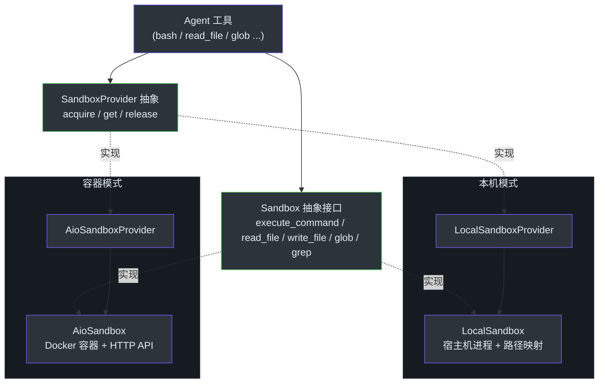
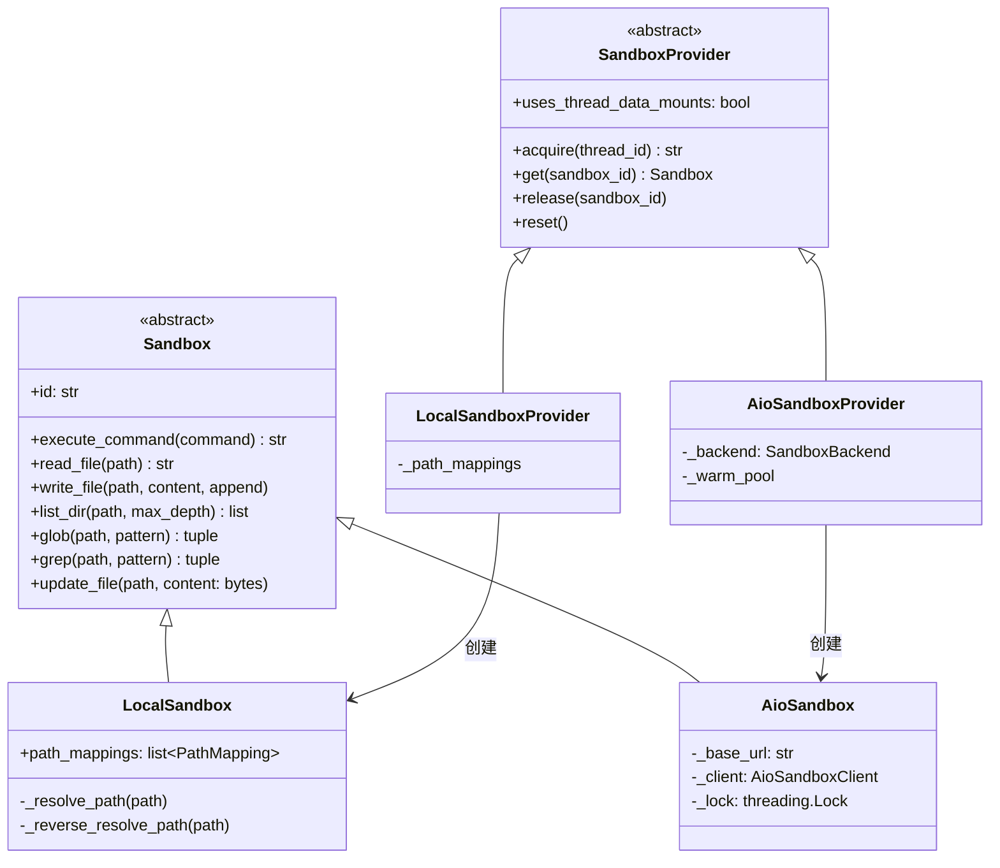
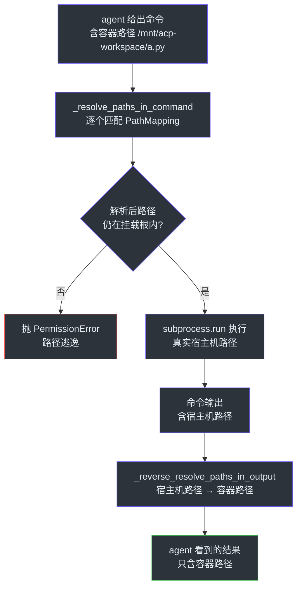
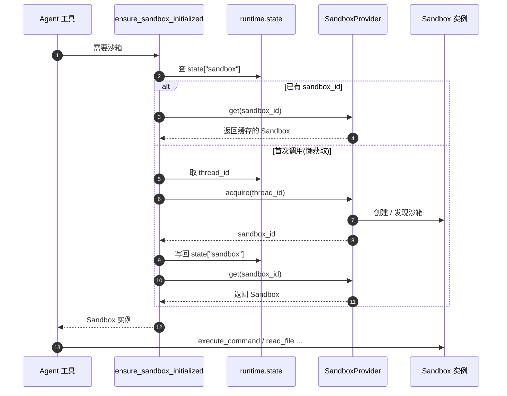
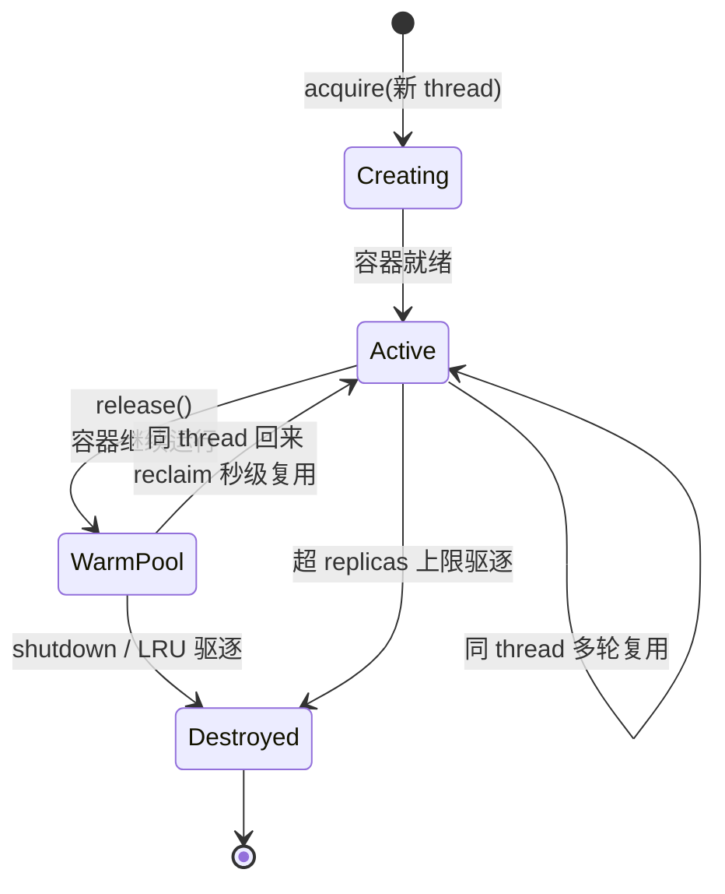

# 沙箱架构与实现

> **本章目标**:
> 1. 理解 DeerFlow 为什么用 `Sandbox` + `SandboxProvider` 两层抽象隔离 agent 的文件与命令操作
> 2. 看懂 `LocalSandbox`(本机进程)与 `AioSandbox`(Docker 容器)两套实现的本质差异——尤其是路径映射和容器生命周期
> 3. 掌握沙箱从"获取"到"复用"到"释放"的完整生命周期,以及 lazy 获取的触发链路

## TL;DR

DeerFlow 把 agent 对外部世界(文件系统、shell)的所有操作收敛到一个 `Sandbox` 抽象接口背后,由 `SandboxProvider` 负责沙箱的获取与回收。系统内置两套实现:`LocalSandbox` 直接在宿主机进程里跑命令,靠**路径映射**把 agent 看到的"容器路径"翻译成宿主机真实路径并拦截越界访问;`AioSandbox` 连一个独立 Docker 容器,通过 HTTP API 操作,实现真正的进程级隔离。沙箱默认**懒获取**——第一次工具调用时才真正创建,且**跨多轮对话复用**同一沙箱,`AioSandboxProvider` 还用"warm pool"避免重复冷启动。

## Overview(为什么需要沙箱抽象)

一个能执行任意 shell 命令、读写任意文件的 agent,本质是一把双刃剑:能力越强,失控的代价越大。沙箱要回答的核心问题是:**怎么让 agent 既能自由地跑命令、读写文件,又不会把宿主机搞坏、不会读到不该读的东西?**

直觉做法是让工具直接调 `subprocess.run` 和 `open()`。但这样有三个无法回避的问题:

1. **无隔离**:agent 生成的命令直接在主进程权限下执行,一句 `rm -rf` 就能毁掉宿主机。
2. **无法切换执行环境**:本地开发想图快直接在宿主机跑,生产环境想要容器隔离——如果工具里写死了 `subprocess`,这两种模式就得两套代码。
3. **路径语义不统一**:agent 被告知工作区在 `/mnt/acp-workspace`,但本机模式下这个路径根本不存在,真实文件在某个临时目录里。

DeerFlow 的答案是**两层抽象**:

- `Sandbox` —— 一个抽象接口,定义"在沙箱里能做什么"(执行命令、读写文件、glob、grep)。工具只认这个接口,不关心底层是进程还是容器([sandbox.py:6-93](https://github.com/bytedance/deer-flow/blob/main/backend/packages/harness/deerflow/sandbox/sandbox.py#L6-L93))。
- `SandboxProvider` —— 负责"沙箱从哪来、怎么回收"。换执行环境 = 换一个 provider,工具代码一行不改([sandbox_provider.py:8-42](https://github.com/bytedance/deer-flow/blob/main/backend/packages/harness/deerflow/sandbox/sandbox_provider.py#L8-L42))。

到底用哪个 provider,由 `config.yaml` 的 `sandbox.use` 字段决定,`get_sandbox_provider()` 用反射把类名解析成具体类并缓存成单例([sandbox_provider.py:48-62](https://github.com/bytedance/deer-flow/blob/main/backend/packages/harness/deerflow/sandbox/sandbox_provider.py#L48-L62))。


<!-- Sources: backend/packages/harness/deerflow/sandbox/sandbox.py:6-93, backend/packages/harness/deerflow/sandbox/sandbox_provider.py:8-62 -->

## Architecture

沙箱系统由四个角色组成,职责严格分层。

| 角色 | 职责 | 关键类 | Source |
|---|---|---|---|
| 操作接口 | 定义"在沙箱里能做什么" | `Sandbox`(ABC) | [sandbox.py:6](https://github.com/bytedance/deer-flow/blob/main/backend/packages/harness/deerflow/sandbox/sandbox.py#L6) |
| 生命周期管理 | 沙箱的获取 / 查找 / 释放 | `SandboxProvider`(ABC) | [sandbox_provider.py:8](https://github.com/bytedance/deer-flow/blob/main/backend/packages/harness/deerflow/sandbox/sandbox_provider.py#L8) |
| 本机实现 | 进程内执行 + 路径映射 | `LocalSandbox` / `LocalSandboxProvider` | [local_sandbox.py:29](https://github.com/bytedance/deer-flow/blob/main/backend/packages/harness/deerflow/sandbox/local/local_sandbox.py#L29) |
| 容器实现 | Docker 容器 + HTTP API | `AioSandbox` / `AioSandboxProvider` | [aio_sandbox.py:17](https://github.com/bytedance/deer-flow/blob/main/backend/packages/harness/deerflow/community/aio_sandbox/aio_sandbox.py#L17) |
| 链路接入 | 在 agent 生命周期里管理沙箱 | `SandboxMiddleware` | [sandbox/middleware.py:21](https://github.com/bytedance/deer-flow/blob/main/backend/packages/harness/deerflow/sandbox/middleware.py#L21) |

`Sandbox` 接口只有 7 个抽象方法:`execute_command`、`read_file`、`list_dir`、`write_file`、`glob`、`grep`、`update_file`([sandbox.py:18-93](https://github.com/bytedance/deer-flow/blob/main/backend/packages/harness/deerflow/sandbox/sandbox.py#L18-L93))。注意它**不**暴露"删文件""创建目录"这类操作——能力面被刻意收窄。`SandboxProvider` 接口同样精简,核心是 `acquire`(拿一个沙箱,返回 ID)、`get`(按 ID 取沙箱实例)、`release`(归还),外加可选的 `reset` / `shutdown`([sandbox_provider.py:13-42](https://github.com/bytedance/deer-flow/blob/main/backend/packages/harness/deerflow/sandbox/sandbox_provider.py#L13-L42))。

`SandboxProvider` 上有个值得注意的类属性 `uses_thread_data_mounts`:`LocalSandboxProvider` 设为 `True`,表示它需要 thread 级的目录挂载信息([local_sandbox_provider.py:14](https://github.com/bytedance/deer-flow/blob/main/backend/packages/harness/deerflow/sandbox/local/local_sandbox_provider.py#L14))。


<!-- Sources: backend/packages/harness/deerflow/sandbox/sandbox.py:6-93, backend/packages/harness/deerflow/sandbox/sandbox_provider.py:8-42, backend/packages/harness/deerflow/sandbox/local/local_sandbox.py:29-67, backend/packages/harness/deerflow/community/aio_sandbox/aio_sandbox.py:17-37 -->

## Components / 双实现对比

`LocalSandbox` 和 `AioSandbox` 实现同一个 `Sandbox` 接口,但隔离模型截然不同。

| 维度 | LocalSandbox | AioSandbox |
|---|---|---|
| 执行位置 | 宿主机进程,`subprocess.run` | 独立 Docker 容器,HTTP API |
| 隔离强度 | 无进程隔离,靠路径映射限制文件范围 | 真正的容器隔离 |
| 路径处理 | 容器路径 ↔ 宿主机路径双向翻译 | 路径直接传给容器,无需翻译 |
| 并发控制 | 无(进程内直接跑) | `threading.Lock` 串行化命令 |
| 冷启动成本 | 几乎为零 | 需拉起容器 |
| 适用场景 | 本地开发、图快 | 生产、需要隔离 |
| Source | [local_sandbox.py:29](https://github.com/bytedance/deer-flow/blob/main/backend/packages/harness/deerflow/sandbox/local/local_sandbox.py#L29) | [aio_sandbox.py:17](https://github.com/bytedance/deer-flow/blob/main/backend/packages/harness/deerflow/community/aio_sandbox/aio_sandbox.py#L17) |

### LocalSandbox —— 路径映射是核心

`LocalSandbox` 没有真正的隔离边界。agent 以为自己在一个容器里,工作区是 `/mnt/acp-workspace`、技能在 `/mnt/skills`——但本机上这些路径不存在。`LocalSandbox` 靠一组 `PathMapping` 在"容器路径"和"宿主机真实路径"之间做双向翻译。`PathMapping` 是个简单的三元组:容器路径、本机路径、是否只读([local_sandbox.py:15-21](https://github.com/bytedance/deer-flow/blob/main/backend/packages/harness/deerflow/sandbox/local/local_sandbox.py#L15-L21))。

翻译分两个方向:

- **正向解析(`_resolve_path`)**:agent 给的容器路径 → 宿主机真实路径。执行命令前用 `_resolve_paths_in_command` 把命令字符串里所有容器路径替换掉([local_sandbox.py:216-246](https://github.com/bytedance/deer-flow/blob/main/backend/packages/harness/deerflow/sandbox/local/local_sandbox.py#L216-L246));写文件时连文件内容里的容器路径也一并解析([local_sandbox.py:248-279](https://github.com/bytedance/deer-flow/blob/main/backend/packages/harness/deerflow/sandbox/local/local_sandbox.py#L248-L279))。
- **反向解析(`_reverse_resolve_path`)**:命令输出 / 目录列表里的宿主机路径 → 容器路径,这样 agent 永远看不到宿主机的真实路径布局([local_sandbox.py:156-214](https://github.com/bytedance/deer-flow/blob/main/backend/packages/harness/deerflow/sandbox/local/local_sandbox.py#L156-L214))。

正向解析里藏着 `LocalSandbox` 唯一的安全边界——**越界拦截**。解析后它会检查目标路径是否还在映射的本机根目录之内,一旦发现路径用 `..` 逃出了挂载目录,直接抛 `PermissionError`:

```python
# 摘自 local_sandbox.py:143-148
try:
    resolved_path.relative_to(local_root)
except ValueError as exc:
    raise PermissionError(errno.EACCES, "Access denied: path escapes mounted directory", path_str) from exc
```

只读保护是第二道边界:`write_file` / `update_file` 在写之前先查目标是否落在只读挂载下,是就抛 `OSError(EROFS)`([local_sandbox.py:382-386](https://github.com/bytedance/deer-flow/blob/main/backend/packages/harness/deerflow/sandbox/local/local_sandbox.py#L382-L386))。skills 目录就被 `LocalSandboxProvider` 强制设成 `read_only=True`——agent 能读技能但改不了([local_sandbox_provider.py:42-48](https://github.com/bytedance/deer-flow/blob/main/backend/packages/harness/deerflow/sandbox/local/local_sandbox_provider.py#L42-L48))。


<!-- Sources: backend/packages/harness/deerflow/sandbox/local/local_sandbox.py:123-148, 216-246, 307-352 -->

`LocalSandbox` 的 `execute_command` 还要处理跨平台 shell 问题:它按 `/bin/zsh → /bin/bash → /bin/sh` 顺序探测,Windows 上再退到 PowerShell、`cmd.exe`,并据此组装不同的命令行参数([local_sandbox.py:281-343](https://github.com/bytedance/deer-flow/blob/main/backend/packages/harness/deerflow/sandbox/local/local_sandbox.py#L281-L343))。

### AioSandbox —— 容器 + HTTP

`AioSandbox` 不在本进程做任何事。它持有一个 `AioSandboxClient`(连容器 HTTP API 的客户端),所有操作转成 HTTP 请求发给容器([aio_sandbox.py:25-37](https://github.com/bytedance/deer-flow/blob/main/backend/packages/harness/deerflow/community/aio_sandbox/aio_sandbox.py#L25-L37))。因为路径真的存在于容器里,它**完全不需要路径映射**——这是它和 `LocalSandbox` 最大的代码差异。

但它要解决一个 `LocalSandbox` 没有的问题:**并发**。AIO 容器维护单个持久 shell 会话,并发的 `exec_command` 会把会话搞乱。`AioSandbox` 用一把 `threading.Lock` 串行化所有命令,并且做了一层防御——如果输出里出现会话损坏的特征字符串 `ErrorObservation`,自动换一个全新会话 ID 重试一次:

```python
# 摘自 aio_sandbox.py:78-82
if output and _ERROR_OBSERVATION_SIGNATURE in output:
    logger.warning("ErrorObservation detected in sandbox output, retrying with a fresh session")
    fresh_id = str(uuid.uuid4())
    result = self._client.shell.exec_command(command=command, id=fresh_id, ...)
    output = result.data.output if result.data else ""
```

## Data Flow / 沙箱生命周期

### 懒获取链路

`SandboxMiddleware` 默认 `lazy_init=True`——agent 启动时**不**创建沙箱,推迟到第一次工具调用([sandbox/middleware.py:24-43](https://github.com/bytedance/deer-flow/blob/main/backend/packages/harness/deerflow/sandbox/middleware.py#L24-L43))。理由很直接:不是每轮对话都用得上沙箱,纯聊天的回合没必要付出创建成本。本章只点到 `SandboxMiddleware` 在链路里的位置,它作为中间件的串联细节见[中间件链机制](./10-zhong-jian-jian-lian-ji-zhi.md)。

真正触发获取的是工具侧的 `ensure_sandbox_initialized`:它先看 runtime state 里有没有现成沙箱,有就复用;没有就从 runtime 取 `thread_id`,调 `provider.acquire(thread_id)` 拿一个,把 `sandbox_id` 写回 state 让后续工具调用复用([tools.py:1051-1107](https://github.com/bytedance/deer-flow/blob/main/backend/packages/harness/deerflow/sandbox/tools.py#L1051-L1107))。


<!-- Sources: backend/packages/harness/deerflow/sandbox/tools.py:1051-1107, backend/packages/harness/deerflow/sandbox/middleware.py:24-65 -->

### 复用与释放策略

沙箱在**同一 thread 的多轮对话间复用**,而不是每轮新建。两个 provider 的复用与释放策略不同:

- **`LocalSandboxProvider`**:`LocalSandbox` 是进程内单例,`acquire` 永远返回同一个 `"local"` 沙箱;`release` 是空操作——没有需要回收的资源([local_sandbox_provider.py:102-121](https://github.com/bytedance/deer-flow/blob/main/backend/packages/harness/deerflow/sandbox/local/local_sandbox_provider.py#L102-L121))。
- **`AioSandboxProvider`**:`acquire` 走三层查找——进程内缓存 → warm pool → 后端发现/创建([aio_sandbox_provider.py:443-486](https://github.com/bytedance/deer-flow/blob/main/backend/packages/harness/deerflow/community/aio_sandbox/aio_sandbox_provider.py#L443-L486))。`thread_id` 决定性地映射到一个沙箱 ID,所以同一 thread 在多进程、多 pod 间都能拿到同一个容器,跨进程竞争用文件锁串行化([aio_sandbox_provider.py:488-530](https://github.com/bytedance/deer-flow/blob/main/backend/packages/harness/deerflow/community/aio_sandbox/aio_sandbox_provider.py#L488-L530))。

`AioSandboxProvider` 的 `release` 不销毁容器,而是把它"停"进 **warm pool**——容器继续运行,下次同一 thread 回来可以秒级"reclaim",省掉冷启动([aio_sandbox_provider.py:623-647](https://github.com/bytedance/deer-flow/blob/main/backend/packages/harness/deerflow/community/aio_sandbox/aio_sandbox_provider.py#L623-L647))。容器只在两种情况下真正被 `destroy`(停掉):并发容器数超过 `replicas` 上限触发 LRU 驱逐,或者应用 `shutdown` 时统一清理([aio_sandbox_provider.py:649-707](https://github.com/bytedance/deer-flow/blob/main/backend/packages/harness/deerflow/community/aio_sandbox/aio_sandbox_provider.py#L649-L707))。


<!-- Sources: backend/packages/harness/deerflow/community/aio_sandbox/aio_sandbox_provider.py:421-486, 623-707 -->

## Common Pitfalls / 实战 Tips

这些都从代码注释和实现里读出:

- **`LocalSandbox` 不是真隔离**:它只有路径映射做的范围限制,没有进程隔离。一句没有路径前缀的 `rm -rf ~` 不会被路径检查拦住——路径映射只拦"显式带容器路径前缀的越界"。要真隔离用 `AioSandbox`。
- **`read_file` 只对 agent 自己写的文件做反向路径解析**:用户上传的文件、外部工具产出的文件不会被改写,避免误伤([local_sandbox.py:366-380](https://github.com/bytedance/deer-flow/blob/main/backend/packages/harness/deerflow/sandbox/local/local_sandbox.py#L366-L380))。
- **AIO 沙箱命令是串行的**:`threading.Lock` 把所有 `execute_command` 串起来,长命令会阻塞同沙箱的其他命令。这是为了防止单会话被并发请求搞坏([aio_sandbox.py:57-66](https://github.com/bytedance/deer-flow/blob/main/backend/packages/harness/deerflow/community/aio_sandbox/aio_sandbox.py#L57-L66))。
- **自定义挂载有保留路径冲突检查**:`config.yaml` 里配的 `mounts` 如果撞上 `/mnt/skills`、`/mnt/acp-workspace`、`/mnt/user-data` 这些保留前缀,会被直接跳过并告警([local_sandbox_provider.py:51-80](https://github.com/bytedance/deer-flow/blob/main/backend/packages/harness/deerflow/sandbox/local/local_sandbox_provider.py#L51-L80))。

## References

- [backend/packages/harness/deerflow/sandbox/sandbox.py](https://github.com/bytedance/deer-flow/blob/main/backend/packages/harness/deerflow/sandbox/sandbox.py) — `Sandbox` 抽象接口,定义 7 个沙箱操作
- [backend/packages/harness/deerflow/sandbox/sandbox_provider.py](https://github.com/bytedance/deer-flow/blob/main/backend/packages/harness/deerflow/sandbox/sandbox_provider.py) — `SandboxProvider` 抽象 + 单例工厂 `get_sandbox_provider`
- [backend/packages/harness/deerflow/sandbox/local/local_sandbox.py](https://github.com/bytedance/deer-flow/blob/main/backend/packages/harness/deerflow/sandbox/local/local_sandbox.py) — `LocalSandbox` 实现,路径映射 `PathMapping` 与越界拦截
- [backend/packages/harness/deerflow/sandbox/local/local_sandbox_provider.py](https://github.com/bytedance/deer-flow/blob/main/backend/packages/harness/deerflow/sandbox/local/local_sandbox_provider.py) — `LocalSandboxProvider`,挂载配置与单例管理
- [backend/packages/harness/deerflow/community/aio_sandbox/aio_sandbox.py](https://github.com/bytedance/deer-flow/blob/main/backend/packages/harness/deerflow/community/aio_sandbox/aio_sandbox.py) — `AioSandbox` 实现,HTTP API + 会话锁
- [backend/packages/harness/deerflow/community/aio_sandbox/aio_sandbox_provider.py](https://github.com/bytedance/deer-flow/blob/main/backend/packages/harness/deerflow/community/aio_sandbox/aio_sandbox_provider.py) — `AioSandboxProvider`,三层获取、warm pool、容器生命周期
- [backend/packages/harness/deerflow/sandbox/middleware.py](https://github.com/bytedance/deer-flow/blob/main/backend/packages/harness/deerflow/sandbox/middleware.py) — `SandboxMiddleware`,沙箱在 agent 链路里的接入点
- [backend/packages/harness/deerflow/sandbox/tools.py](https://github.com/bytedance/deer-flow/blob/main/backend/packages/harness/deerflow/sandbox/tools.py) — `ensure_sandbox_initialized`,工具侧的懒获取入口

## Related Pages

| Page | Relationship |
|---|---|
| [中间件链机制](./10-zhong-jian-jian-lian-ji-zhi.md) | `SandboxMiddleware` 位于中间件链链首,负责沙箱的 `before_agent` 预热与 `after_agent` 释放;本章只点到接入位置,串联细节见该章 |
| [长期记忆机制](./19-chang-qi-ji-yi-ji-zhi.md) | 记忆系统与沙箱同为 agent 的"系统功能",都通过 middleware 接入 agent 生命周期 |
