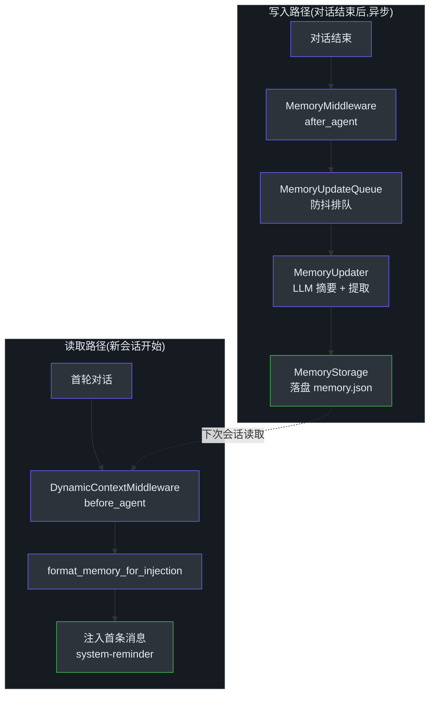
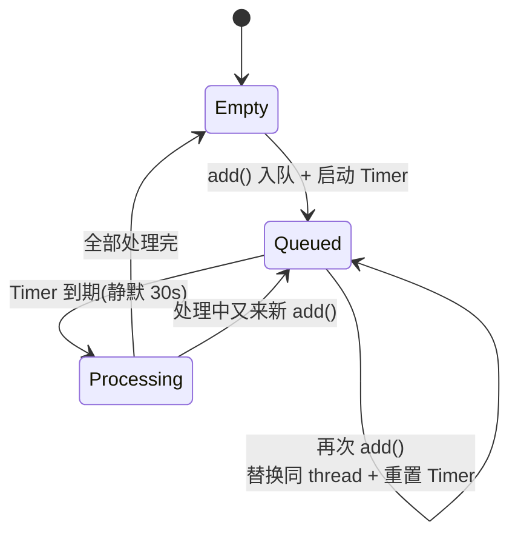
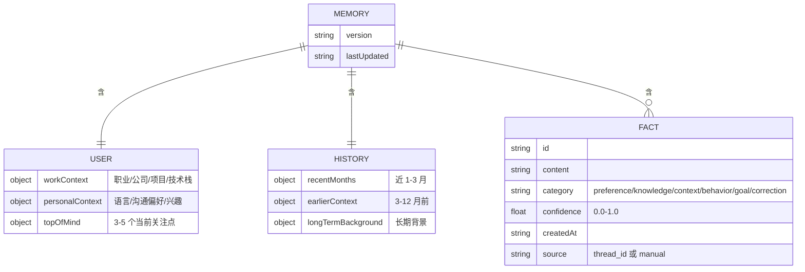
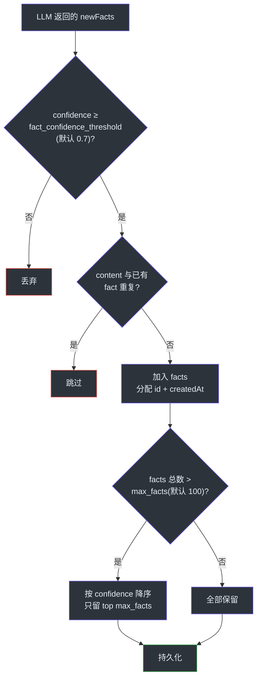

# 长期记忆机制

> **本章目标**:
> 1. 理解 DeerFlow 为什么需要跨会话的长期记忆,以及它和"上下文窗口"的本质区别
> 2. 看懂记忆的完整写入链路——从对话结束到 LLM 摘要再到落盘,以及防抖队列扮演的角色
> 3. 掌握记忆的注入方式、`memory.json` 的数据结构,以及 fact 的留存(retention)策略

## TL;DR

DeerFlow 的长期记忆让 agent 跨会话"记得"用户是谁、在做什么。每轮对话结束后,`MemoryMiddleware` 把对话排进一个**带防抖的队列**;队列在静默几十秒后触发 `MemoryUpdater`,用 LLM 把对话摘要成结构化记忆(用户画像 + 历史 + 离散 fact),通过 `MemoryStorage` 抽象落盘成 `memory.json`。下一次新会话开始时,`DynamicContextMiddleware` 把记忆格式化后注入到首条用户消息的 `<system-reminder>` 里。记忆写入是**异步、最终一致**的——不阻塞对话;fact 有 confidence 阈值、去重、数量上限三道留存闸门。

## Overview(为什么需要长期记忆)

LLM 本身是无状态的:每次调用只能看到这一次传进去的消息。一个会话内,靠"把历史消息一起发过去"维持连续性。但这个机制有个硬边界——**上下文窗口**:窗口装不下无限历史,而且换一个会话(新 `thread_id`),历史就彻底归零。

于是 agent 面对的问题是:**用户上周告诉过它"我用的是 DeepSeek 模型、项目叫 X、不喜欢冗长的回复",这次新开会话,怎么让 agent 还记得?**

把整个历史会话都塞进上下文不可行——token 爆炸,而且大量是无关的过程细节。DeerFlow 的答案是**长期记忆**:不存原始对话,而是用 LLM 把对话**蒸馏**成一份精炼的、结构化的用户画像,持久化到磁盘;新会话开始时把这份画像注回 prompt。模块文档把它的三件事说得很清楚——"把用户上下文和对话历史存进 `memory.json`、用 LLM 摘要并提取 fact、把相关记忆注入 system prompt"([memory/__init__.py:1-7](https://github.com/bytedance/deer-flow/blob/main/backend/packages/harness/deerflow/agents/memory/__init__.py#L1-L7))。

它和会话内的摘要(summarization)是两个层次:summarization 压缩**当前会话**的上下文,长期记忆跨**所有会话**沉淀知识。

<!-- Sources: backend/packages/harness/deerflow/agents/memory/__init__.py:1-33, backend/packages/harness/deerflow/agents/middlewares/memory_middleware.py:28-36, backend/packages/harness/deerflow/agents/middlewares/dynamic_context_middleware.py:82-97 -->

## Architecture

记忆系统由五个组件构成,职责清晰分层。

| 组件 | 职责 | 关键类/函数 | Source |
|---|---|---|---|
| 触发器 | 对话结束后把对话排队 | `MemoryMiddleware.after_agent` | [memory_middleware.py:52](https://github.com/bytedance/deer-flow/blob/main/backend/packages/harness/deerflow/agents/middlewares/memory_middleware.py#L52) |
| 防抖队列 | 批量合并、延迟触发 | `MemoryUpdateQueue` | [queue.py:28](https://github.com/bytedance/deer-flow/blob/main/backend/packages/harness/deerflow/agents/memory/queue.py#L28) |
| 更新器 | 调 LLM 摘要、应用留存策略 | `MemoryUpdater` | [updater.py:276](https://github.com/bytedance/deer-flow/blob/main/backend/packages/harness/deerflow/agents/memory/updater.py#L276) |
| 存储抽象 | 加载 / 保存记忆数据 | `MemoryStorage` / `FileMemoryStorage` | [storage.py:43-62](https://github.com/bytedance/deer-flow/blob/main/backend/packages/harness/deerflow/agents/memory/storage.py#L43-L62) |
| 注入器 | 把记忆写进 system-reminder | `DynamicContextMiddleware` | [dynamic_context_middleware.py:82](https://github.com/bytedance/deer-flow/blob/main/backend/packages/harness/deerflow/agents/middlewares/dynamic_context_middleware.py#L82) |

`MemoryStorage` 是个抽象基类,只定义 `load` / `reload` / `save` 三个方法([storage.py:43-59](https://github.com/bytedance/deer-flow/blob/main/backend/packages/harness/deerflow/agents/memory/storage.py#L43-L59))。内置实现 `FileMemoryStorage` 把记忆存成 JSON 文件,带 mtime 缓存。换存储后端(比如换数据库)只需配置 `memory.storage_class` 指向另一个 `MemoryStorage` 子类,`get_memory_storage` 用反射加载它——加载失败会**降级回** `FileMemoryStorage` 并打 error 日志([storage.py:196-231](https://github.com/bytedance/deer-flow/blob/main/backend/packages/harness/deerflow/agents/memory/storage.py#L196-L231))。

记忆按 `(user_id, agent_name)` 二元组隔离:不同用户、不同 custom agent 各有独立的 `memory.json`,互不串味([storage.py:84-102](https://github.com/bytedance/deer-flow/blob/main/backend/packages/harness/deerflow/agents/memory/storage.py#L84-L102))。

<!-- Sources: backend/packages/harness/deerflow/agents/memory/queue.py:28-79, backend/packages/harness/deerflow/agents/memory/updater.py:276-345, backend/packages/harness/deerflow/agents/memory/storage.py:62-189 -->

## Components / 核心机制

### 写入触发 —— `MemoryMiddleware.after_agent`

记忆写入由 `MemoryMiddleware` 在 agent 整轮跑完后通过 `after_agent` hook 触发(它在中间件链里的位置见[中间件链机制](./10-zhong-jian-jian-lian-ji-zhi.md))。它做四件事([memory_middleware.py:52-110](https://github.com/bytedance/deer-flow/blob/main/backend/packages/harness/deerflow/agents/middlewares/memory_middleware.py#L52-L110)):

1. **过滤消息**:`filter_messages_for_memory` 只保留用户输入和**最终**助手回复,丢掉所有工具调用过程——记忆要的是结论不是过程([message_processing.py:56-85](https://github.com/bytedance/deer-flow/blob/main/backend/packages/harness/deerflow/agents/memory/message_processing.py#L56-L85))。
2. **检测信号**:`detect_correction` / `detect_reinforcement` 用正则扫最近 6 条用户消息,识别"用户纠正了 agent"或"用户确认 agent 做对了"——中英文 pattern 都有,如 `不对` / `that's wrong` / `完全正确` / `perfect`([message_processing.py:10-37](https://github.com/bytedance/deer-flow/blob/main/backend/packages/harness/deerflow/agents/memory/message_processing.py#L10-L37))。
3. **门槛检查**:至少要有一条用户消息和一条助手回复才值得排队([memory_middleware.py:87-91](https://github.com/bytedance/deer-flow/blob/main/backend/packages/harness/deerflow/agents/middlewares/memory_middleware.py#L87-L91))。
4. **排队**:连同 `user_id` 一起塞进 `MemoryUpdateQueue`。注意 `user_id` 必须在排队时就抓取——队列稍后在另一个线程触发,`ContextVar` 不会跨线程传播([memory_middleware.py:96-108](https://github.com/bytedance/deer-flow/blob/main/backend/packages/harness/deerflow/agents/middlewares/memory_middleware.py#L96-L108))。

它**只排队、不更新**——`after_agent` 返回 `None`,不改 agent state。真正的 LLM 摘要是异步发生的,这样记忆更新永远不阻塞用户对话。

### 防抖队列 —— 为什么不立即更新

`MemoryUpdateQueue` 是个全局单例,核心是**防抖(debounce)**机制([queue.py:28-34](https://github.com/bytedance/deer-flow/blob/main/backend/packages/harness/deerflow/agents/memory/queue.py#L28-L34))。每次 `add` 一个对话,它都重置一个 `threading.Timer`——只有在静默 `debounce_seconds`(默认 30 秒)后,队列才真正触发处理([queue.py:136-154](https://github.com/bytedance/deer-flow/blob/main/backend/packages/harness/deerflow/agents/memory/queue.py#L136-L154))。

为什么要防抖?用户连续追问几轮时,每轮都立刻跑一次 LLM 摘要既浪费又互相覆盖。防抖把短时间内的多轮对话攒在一起。`_enqueue_locked` 还做了一层**按 thread 去重**:同一个 `thread_id` 的旧 context 会被新的替换,只保留最新一份,但 `correction` / `reinforcement` 信号是合并(or)的——一旦在这个窗口里出现过纠正信号就不会丢([queue.py:108-134](https://github.com/bytedance/deer-flow/blob/main/backend/packages/harness/deerflow/agents/memory/queue.py#L108-L134))。

<!-- Sources: backend/packages/harness/deerflow/agents/memory/queue.py:43-79, 108-204 -->

处理时,`_process_queue` 用 `_processing` 标志保证不并发,逐个 context 调 `MemoryUpdater.update_memory`。多个 context 之间还插 0.5 秒间隔,避免触发模型限流([queue.py:156-204](https://github.com/bytedance/deer-flow/blob/main/backend/packages/harness/deerflow/agents/memory/queue.py#L156-L204))。

### 提取 —— `MemoryUpdater` 用 LLM 蒸馏对话

`MemoryUpdater` 是真正"动脑子"的环节。`update_memory` 的核心流程([updater.py:396-433](https://github.com/bytedance/deer-flow/blob/main/backend/packages/harness/deerflow/agents/memory/updater.py#L396-L433)):

1. **准备 prompt**:加载当前记忆,把对话格式化成文本,连同 `MEMORY_UPDATE_PROMPT` 模板拼成一个完整 prompt([updater.py:318-345](https://github.com/bytedance/deer-flow/blob/main/backend/packages/harness/deerflow/agents/memory/updater.py#L318-L345))。这个 prompt 很长——它教模型怎么分类 fact、怎么定 confidence、哪些信息进 `workContext` 哪些进 `topOfMind`([prompt.py:15-131](https://github.com/bytedance/deer-flow/blob/main/backend/packages/harness/deerflow/agents/memory/prompt.py#L15-L131))。
2. **调模型**:用 `model.invoke()` **同步** HTTP 调用。这是有意为之——注释说明它要避开 lead agent 共享的 async httpx 连接池,防止跨事件循环的连接复用 bug([updater.py:405-412](https://github.com/bytedance/deer-flow/blob/main/backend/packages/harness/deerflow/agents/memory/updater.py#L405-L412))。
3. **应用更新**:解析模型返回的 JSON,交给 `_apply_updates` 合并进现有记忆([updater.py:347-367](https://github.com/bytedance/deer-flow/blob/main/backend/packages/harness/deerflow/agents/memory/updater.py#L347-L367))。

如果检测到了 correction / reinforcement 信号,`_build_correction_hint` 会往 prompt 里追加一段提示,要求模型把"用户纠正了什么""确认了什么"记成高 confidence 的 `correction` / `preference` fact([updater.py:293-316](https://github.com/bytedance/deer-flow/blob/main/backend/packages/harness/deerflow/agents/memory/updater.py#L293-L316))。

### 记忆数据结构

`memory.json` 有固定的三段式结构,`create_empty_memory` 定义了骨架([storage.py:24-40](https://github.com/bytedance/deer-flow/blob/main/backend/packages/harness/deerflow/agents/memory/storage.py#L24-L40)):

<!-- Sources: backend/packages/harness/deerflow/agents/memory/storage.py:24-40, backend/packages/harness/deerflow/agents/memory/updater.py:560-573 -->

`user` 和 `history` 是**摘要型**记忆(每段一句话或一段话),`facts` 是**离散型**记忆(一条条独立 fact)。两者更新方式不同:摘要靠模型整段重写,fact 靠增删。

### 注入 —— `DynamicContextMiddleware`

记忆怎么进 prompt?由 `DynamicContextMiddleware` 在 `before_agent` 阶段完成。它把记忆和当前日期拼成一个 `<system-reminder>`,**前置到首条用户消息**而不是塞进 system prompt([dynamic_context_middleware.py:104-119](https://github.com/bytedance/deer-flow/blob/main/backend/packages/harness/deerflow/agents/middlewares/dynamic_context_middleware.py#L104-L119))。

这个设计有讲究:system prompt 保持完全静态,prefix 缓存才能稳定命中。记忆是会变的动态内容,所以单独注入用户消息侧。而且**只在首轮注入一次**——首条消息注入后就"冻结",ID 不变,后续每轮都能复用 prefix 缓存([dynamic_context_middleware.py:84-89](https://github.com/bytedance/deer-flow/blob/main/backend/packages/harness/deerflow/agents/middlewares/dynamic_context_middleware.py#L84-L89))。

注入的内容由 `format_memory_for_injection` 生成:它把 `user` / `history` 摘要逐条排开,fact 按 confidence **降序**排列,在 `max_injection_tokens`(默认 2000)预算内能塞多少塞多少——预算用 tiktoken 精确计量,塞不下的低 confidence fact 直接丢([prompt.py:201-317](https://github.com/bytedance/deer-flow/blob/main/backend/packages/harness/deerflow/agents/memory/prompt.py#L201-L317))。

## Implementation Details —— Fact 留存(retention)策略

`_apply_updates` 是留存策略的核心,新 fact 要过三道闸门才能进 `memory.json`([updater.py:546-584](https://github.com/bytedance/deer-flow/blob/main/backend/packages/harness/deerflow/agents/memory/updater.py#L546-L584)):

<!-- Sources: backend/packages/harness/deerflow/agents/memory/updater.py:502-586 -->

三道闸门:

1. **confidence 阈值**:低于 `fact_confidence_threshold`(默认 0.7)的 fact 不收——记忆只要"确定"的东西([updater.py:550-551](https://github.com/bytedance/deer-flow/blob/main/backend/packages/harness/deerflow/agents/memory/updater.py#L550-L551))。
2. **内容去重**:fact 的 content 做大小写折叠后比对,重复的跳过([updater.py:556-558](https://github.com/bytedance/deer-flow/blob/main/backend/packages/harness/deerflow/agents/memory/updater.py#L556-L558))。
3. **数量上限**:总数超 `max_facts`(默认 100)时,按 confidence 降序砍掉低分的——低 confidence 的旧 fact 会被新的高 confidence fact 挤出去([updater.py:578-584](https://github.com/bytedance/deer-flow/blob/main/backend/packages/harness/deerflow/agents/memory/updater.py#L578-L584))。

模型还能主动**删 fact**:返回的 JSON 里有 `factsToRemove` 列表,被新信息推翻的旧 fact 由模型点名删除([updater.py:542-544](https://github.com/bytedance/deer-flow/blob/main/backend/packages/harness/deerflow/agents/memory/updater.py#L542-L544))。

落盘由 `FileMemoryStorage.save` 完成,用"写临时文件 + 原子 `replace`"避免写一半崩了导致 `memory.json` 损坏([storage.py:160-189](https://github.com/bytedance/deer-flow/blob/main/backend/packages/harness/deerflow/agents/memory/storage.py#L160-L189))。

## Configuration

`config.yaml` 的 `memory` 段([memory_config.py:6-62](https://github.com/bytedance/deer-flow/blob/main/backend/packages/harness/deerflow/config/memory_config.py#L6-L62)):

| Config | 默认 | 含义 | Source |
|---|---|---|---|
| `enabled` | `true` | 是否启用记忆机制 | [memory_config.py:9](https://github.com/bytedance/deer-flow/blob/main/backend/packages/harness/deerflow/config/memory_config.py#L9) |
| `storage_class` | `FileMemoryStorage` | 存储后端类路径 | [memory_config.py:27](https://github.com/bytedance/deer-flow/blob/main/backend/packages/harness/deerflow/config/memory_config.py#L27) |
| `debounce_seconds` | `30` | 队列防抖等待秒数(1-300) | [memory_config.py:31](https://github.com/bytedance/deer-flow/blob/main/backend/packages/harness/deerflow/config/memory_config.py#L31) |
| `model_name` | `None` | 摘要用模型(None = 默认模型) | [memory_config.py:37](https://github.com/bytedance/deer-flow/blob/main/backend/packages/harness/deerflow/config/memory_config.py#L37) |
| `max_facts` | `100` | fact 数量上限(10-500) | [memory_config.py:41](https://github.com/bytedance/deer-flow/blob/main/backend/packages/harness/deerflow/config/memory_config.py#L41) |
| `fact_confidence_threshold` | `0.7` | 存 fact 的最低 confidence | [memory_config.py:47](https://github.com/bytedance/deer-flow/blob/main/backend/packages/harness/deerflow/config/memory_config.py#L47) |
| `injection_enabled` | `true` | 是否把记忆注入 prompt | [memory_config.py:53](https://github.com/bytedance/deer-flow/blob/main/backend/packages/harness/deerflow/config/memory_config.py#L53) |
| `max_injection_tokens` | `2000` | 注入记忆的 token 预算 | [memory_config.py:57](https://github.com/bytedance/deer-flow/blob/main/backend/packages/harness/deerflow/config/memory_config.py#L57) |

## Common Pitfalls / 实战 Tips

均从代码与注释读出:

- **上传文件不会被记进记忆**:`format_conversation_for_update` 会剥掉 `<uploaded_files>` 标签,`_strip_upload_mentions_from_memory` 还会从摘要和 fact 里清掉"上传文件"相关句子。原因:上传文件是会话级、临时的,记进长期记忆会让 agent 在未来会话里找不存在的文件([updater.py:230-264](https://github.com/bytedance/deer-flow/blob/main/backend/packages/harness/deerflow/agents/memory/updater.py#L230-L264))。
- **记忆是最终一致的**:`after_agent` 只排队,真正写入要等防抖窗口(默认 30 秒)。进程在窗口内退出,这轮记忆会丢——daemon 线程的 best-effort 语义([queue.py:218-223](https://github.com/bytedance/deer-flow/blob/main/backend/packages/harness/deerflow/agents/memory/queue.py#L218-L223))。
- **`storage_path` 配绝对路径会退出按用户隔离**:此时所有用户共享同一个 `memory.json`,慎用([memory_config.py:13-26](https://github.com/bytedance/deer-flow/blob/main/backend/packages/harness/deerflow/config/memory_config.py#L13-L26))。

## References

- [backend/packages/harness/deerflow/agents/memory/__init__.py](https://github.com/bytedance/deer-flow/blob/main/backend/packages/harness/deerflow/agents/memory/__init__.py) — 记忆模块总览与公开 API
- [backend/packages/harness/deerflow/agents/middlewares/memory_middleware.py](https://github.com/bytedance/deer-flow/blob/main/backend/packages/harness/deerflow/agents/middlewares/memory_middleware.py) — `MemoryMiddleware`,`after_agent` 触发排队
- [backend/packages/harness/deerflow/agents/memory/queue.py](https://github.com/bytedance/deer-flow/blob/main/backend/packages/harness/deerflow/agents/memory/queue.py) — `MemoryUpdateQueue`,防抖批处理
- [backend/packages/harness/deerflow/agents/memory/updater.py](https://github.com/bytedance/deer-flow/blob/main/backend/packages/harness/deerflow/agents/memory/updater.py) — `MemoryUpdater`,LLM 摘要与 fact 留存策略
- [backend/packages/harness/deerflow/agents/memory/storage.py](https://github.com/bytedance/deer-flow/blob/main/backend/packages/harness/deerflow/agents/memory/storage.py) — `MemoryStorage` 抽象与 `FileMemoryStorage` 落盘
- [backend/packages/harness/deerflow/agents/memory/prompt.py](https://github.com/bytedance/deer-flow/blob/main/backend/packages/harness/deerflow/agents/memory/prompt.py) — 更新 prompt 模板与 `format_memory_for_injection`
- [backend/packages/harness/deerflow/agents/memory/message_processing.py](https://github.com/bytedance/deer-flow/blob/main/backend/packages/harness/deerflow/agents/memory/message_processing.py) — 消息过滤、纠正/强化信号检测
- [backend/packages/harness/deerflow/agents/middlewares/dynamic_context_middleware.py](https://github.com/bytedance/deer-flow/blob/main/backend/packages/harness/deerflow/agents/middlewares/dynamic_context_middleware.py) — `DynamicContextMiddleware`,记忆注入
- [backend/packages/harness/deerflow/config/memory_config.py](https://github.com/bytedance/deer-flow/blob/main/backend/packages/harness/deerflow/config/memory_config.py) — `MemoryConfig` 配置项

## Related Pages

| Page | Relationship |
|---|---|
| [中间件链机制](./10-zhong-jian-jian-lian-ji-zhi.md) | `MemoryMiddleware` 与 `DynamicContextMiddleware` 都是中间件链的一环,记忆的写入触发与注入都靠中间件 hook;链的串联机制见该章 |
| [沙箱架构与实现](./14-sha-xiang-jia-gou-yu-shi-xian.md) | 沙箱与记忆同为 agent 的系统功能,沙箱按 `thread_id` 隔离、记忆按 `(user_id, agent_name)` 隔离,隔离粒度可对照参考 |
