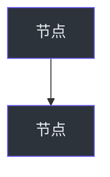

# Methodology — Claude-Wiki-Gen 核心 SOP

> **谁来读**：Claude Code（执行 wiki 生成的那位）  
> **怎么用**：trigger-prompts/full-run.md 会让你先读这份文档，再读 prompts/01-* 02-* 03-* 04-*，建立完整 mental model 后开干。

---

## 1. 核心原则（10 条，全部硬性）

| # | 原则 | 含义 |
|---|---|---|
| 1 | **源码追溯** | 每个非微小断言必须带行号引用,格式见 §4 |
| 2 | **结构优先** | 必须先生成 TOC（JSON 形式）再写章节内容,不要边想边写 |
| 3 | **证据驱动** | 每个论断引具体代码位置——读了什么文件就说读了什么,不读就不要写"应该是这样" |
| 4 | **图表丰富** | 每章 3-5 个 Mermaid,且**混合 2+ 不同类型**（graph / sequence / state / ER / class / flowchart） |
| 5 | **表格化** | 结构化信息（API / config / 组件清单 / 对比）**优先用表格**,不用段落 |
| 6 | **渐进展开** | 每节开头 TL;DR → 中段架构 → 末段细节 |
| 7 | **层级控制** | TOC 最多 4 层深度,每节最多 8 子节 |
| 8 | **系统思维** | 章节组织 = 架构 → 子系统 → 组件 → 方法 |
| 9 | **绝不编造** | 你没读过的代码,**不要写**。宁可写"未在本次扫描中分析（建议: read X 来补充）"也不胡编 |
| 10 | **中文母语** | 内容写给中国开发者,自然中文表达。**专有名词保留英文**（如 middleware / sandbox / agent）,但解释用中文 |

---

## 2. 三阶段工作流

```
阶段 A: 准备(< 5 分钟)
  ├── 解析仓库元信息(git remote, 默认分支, 项目类型)
  ├── 扫文件树,识别主要语言/框架/层次
  └── 决定 REPO_URL + BRANCH 用作源码引用

阶段 B: TOC 生成(< 15 分钟)
  ├── 读 README.md / pyproject.toml / package.json 建立总览
  ├── 用 prompts/01-toc-generation.md 的指导生成 JSON 目录
  ├── 输出到 wiki.json,章节数控制在 20-35 之间
  └── ⚠️ 用户确认 TOC 后才进入阶段 C(如果是 partial-run 跳过确认)

阶段 C: 逐章生成(主要时间)
  对每个章节:
  ├── 用 prompts/02-chapter-writing.md 的方法
  ├── Glob/Grep 定位本章相关源文件(不是全读,按主题精准筛)
  ├── Read 关键文件(优先实现文件 + 入口文件,跳过 vendored / generated)
  ├── 写 markdown(必含 3-5 mermaid + 5+ 文件引用)
  └── 落盘到 <repo>/.claude-wiki/versions/<时间戳>/<slug>.md

收尾:
  ├── 跑一遍 prompts/03-quality-check.md(自查每章)
  ├── 跑一遍 prompts/04-cross-reference.md(补 Related Pages)
  └── 更新 current 文件指针
```

---

## 3. 输出 schema（对齐通用 wiki 工具格式）

> 该 schema 是 DeepWiki / Zread 等同类工具的事实通用格式,采用它便于产物在不同工具间互通。

### 3.1 目录文件 wiki.json

```json
{
  "id": "2026-05-15-153000",
  "generated_at": "2026-05-15T15:30:00Z",
  "language": "zh",
  "generator": "claude-wiki-gen-v0.2",
  "model": "claude-opus-4-7",
  "source_repo": "https://github.com/bytedance/deer-flow",
  "source_branch": "main",
  "source_commit": "6e8e6a96",
  "pages": [
    {
      "slug": "1-项目概览",
      "title": "项目概览",
      "file": "1-项目概览.md",
      "section": "入门指南",
      "level": "Beginner"
    },
    ...
  ]
}
```

字段说明：
- `slug` / `file`: **编号 + 中文标题**(如 `10-中间件链机制`)。中文文件名对中文读者最友好,Windows / Obsidian / VS Code / git 均原生支持。
  - 编号前缀保证排序;编号后接章节中文 title 原样
  - ⚠️ 唯一注意:若将来要把 wiki 发布成静态网站(VitePress 等),中文 URL 需 percent-encode(能用但 URL 较长)。仅本地阅读则无影响。
- `section`: 分组(入门指南 / 配置详解 / 核心架构 / 系统功能 / 前端开发 / 高级主题等)
- `level`: Beginner / Intermediate / Advanced
- `generator` / `model` / `source_commit`: 本系统特有的元数据

### 3.2 单章 markdown 结构

```markdown
# <章节标题>

> **本章目标**:
> 1. 学完能干啥(一句话)
> 2. 学完能干啥(一句话)
> 3. 学完能干啥(一句话)

## TL;DR

3-5 句话总结本章。

## Overview(讲 WHY)

为什么这个组件/系统存在? 解决什么问题? 设计动机是什么?
(避免一上来就讲代码——先建立"问题意识")

## Architecture

整体架构 + 主 Mermaid 图(graph TD)。
配 summary table 列出主要参与方。

## Components / Subsystems

逐个组件展开:
- 职责(一句话)
- 关键类 / 接口(带行号引用)
- 跟其他组件的关系

## Data Flow

数据 / 控制 / 请求如何流转。
配 sequenceDiagram 或 flowchart。

## Implementation Details(可选,深度章节才写)

关键算法 / 设计模式 / 巧妙之处。
带源码片段(< 20 行) + 注释。

## Configuration(如适用)

|  config 项 | 默认 | 含义 | Source |
|---|---|---|---|
| ... | ... | ... | [file:line](url) |

## Common Pitfalls / Tips(可选)

实战避坑(只在你真的读出来踩过的坑才写,不要凭空)。

## References

- [<file_path>:<line>](<github_url>) — <一句话说这文件干啥>
- ...

## Related Pages

| Page | Relationship |
|---|---|
| [Authentication](../X-auth/...) | 本章使用其 token |
| ... | ... |
```

---

## 4. 引用格式（重要！直接决定文档质量）

### 4.1 单行引用
```markdown
[backend/app/middleware.py:42](https://github.com/bytedance/deer-flow/blob/main/backend/app/middleware.py#L42)
```

### 4.2 行范围引用
```markdown
[backend/app/middleware.py:42-58](https://github.com/bytedance/deer-flow/blob/main/backend/app/middleware.py#L42-L58)
```

### 4.3 Mermaid 后必须加 Sources 注释

`<!-- Sources: backend/app/middleware.py:42, backend/app/agent.py:100-120 -->`

### 4.4 表格里有引用必加"Source"列
```markdown
| 组件 | 职责 | Source |
|---|---|---|
| AuthMiddleware | 鉴权 | [...](...) |
```

### 4.5 不知道答案的情况
**绝对禁止编造**。写：
> ⚠️ 本次扫描未深入分析,建议补读 `path/to/file` 验证

或者干脆不写那段。

---

## 5. Mermaid 风格规范

### 5.1 暗色模式(强制)
所有 Mermaid 用暗色配色,因为 Obsidian/VitePress/Zread 默认暗主题:



颜色码:
- 节点 fill: `#2d333b`
- 节点 stroke: `#6d5dfc`(主)/ `#3fb950`(成功) / `#f85149`(失败)
- 节点 text color: `#e6edf3`
- subgraph background: `#161b22`
- subgraph border: `#30363d`

### 5.2 图类型选择
- **结构关系** → `graph TD` / `flowchart`
- **时序交互** → `sequenceDiagram`(必加 `autonumber`)
- **状态机** → `stateDiagram-v2`
- **数据模型** → `erDiagram`
- **类层次** → `classDiagram`

### 5.3 一章必须 2+ 类型混用
比如 Overview 用 graph + sequenceDiagram,不要 4 个全是 graph。

### 5.4 禁用
- `<br/>` (用 `<br>` 或换行)
- 3 位 hex 色号(用 6 位,`#fff` → `#ffffff`)

---

## 6. 章节切分指南

### 6.1 分组框架 + 示例(20-35 章)

> ⚠️ **下面的分组名是通用的(任何项目都适用),但每个分组下列的"示例章节"是按 AI agent 类项目(如 deer-flow)举例。分析其他类型项目时,分组保留,具体章节必须从目标仓库实际派生——不要硬套下面的章节名。**
>
> 不同项目类型的章节会完全不同,例如:
> - Web 框架 → 路由 / 中间件 / ORM / 模板引擎 / 请求生命周期
> - 前端组件库 → 组件 API / 主题系统 / 构建打包 / 按需加载 / Storybook
> - CLI 工具 → 命令结构 / 参数解析 / 配置加载 / 子命令 / 发布流程
> - 数据库 → 存储引擎 / 查询优化器 / 事务 / WAL / 复制

**入门指南** (Beginner) — 示例(AI agent 类):
- 项目概览 / 快速开始 / 环境准备与安装

**配置详解** (Intermediate) — 示例:
- 模型配置 / 沙箱与工具配置 / MCP 集成 / Docker 部署

**核心架构** (Intermediate-Advanced) — 示例:
- 系统整体架构 / Lead Agent 设计 / 中间件链 / 网关 API / 线程状态 / 会话生命周期

**系统功能** (Intermediate) — 示例:
- 沙箱架构 / 子代理委派 / 长期记忆 / 工具开发 / MCP 工具 / 自定义工具

**前端开发** (Intermediate,仅当项目有前端) — 示例:
- 前端技术栈 / AI 消息流 / 工作区聊天 / 技能管理 / 线程上传

**高级主题** (Advanced) — 示例:
- 技能系统 / Skill-MD 规范 / 动态加载 / 社区技能 / IM 通道 / 安全沙箱 / 性能监控 / 测试策略

### 6.2 切分原则
- **不重叠**:同一概念只在一章重点讲,其他章引用而非重述
- **不遗漏**:扫源码时如果发现某模块没对应章节,新增章节而不是塞进现有章节
- **粒度合理**:单章 200-500 行 markdown 为宜,太短合并,太长拆分
- **拓扑排序**:Beginner → Intermediate → Advanced 不能跳

---

## 7. 检索策略（用 Claude Code 工具栈实现 RAG）

对每个章节,**不要读全仓**,按主题精准检索:

```
本章主题: Middleware Chain Execution

1. Glob 找候选文件:
   - **/middleware*.py
   - **/middlewares/**
   - **/agents/*.py

2. Grep 找关键模式:
   - "class.*Middleware"
   - "before_agent" / "after_agent"
   - "AgentMiddleware"

3. Read 命中的关键文件(优先实现 .py,然后入口 __init__.py)

4. 按需扩展:Read 一个文件发现它引用了别的关键类 → 顺路读那个文件
```

**避免**：
- ❌ 把整个仓库 Read 一遍(token 爆炸,也没必要)
- ❌ 只 Glob 不 Read(光看文件名写不出深度)
- ❌ 凭文件名臆测(必须读内容)

---

## 8. 质量自检 checklist（写完每章必跑）

- [ ] 章节目标 3 条都明确?
- [ ] TL;DR 有且 ≤ 5 句?
- [ ] Overview 讲了 WHY 不是直接讲 WHAT?
- [ ] 至少 3 个 Mermaid? 2 种以上类型?
- [ ] 每个 Mermaid 后有 `<!-- Sources: -->` 注释?
- [ ] 至少 5 个不同文件被引用?
- [ ] 行号引用格式正确(github.com 链接 + #L42)?
- [ ] 表格用了"Source"列(如有列代码组件)?
- [ ] Related Pages 列了 2+ 相关章节?
- [ ] 没有"应该 / 大概 / 可能"这类未读代码的臆测词?
- [ ] 中文表达自然,不是机翻味?

---

## 9. 时间预算建议

| 仓库规模 | TOC | 单章 | 全 30 章总耗时 |
|---|---|---|---|
| 小(< 5k LOC) | 5 min | 5-10 min | 1-2 小时 |
| 中(5-50k LOC,**deer-flow 在此区间**) | 10 min | 15-25 min | 4-8 小时 |
| 大(> 50k LOC) | 20 min | 30-60 min | 全跑要分多 session |

**单会话内**：deer-flow 30 章可能跑不完——会塞满上下文。建议**分批 + partial-run 续跑**：
- Session 1: 阶段 A + B + 8 章(Beginner 区)
- Session 2: 8-10 章(Intermediate 区)
- Session 3: 剩余章 + 收尾

---

## 10. Lessons Learned（迭代追加）

### v0.1 (2026-05-15) 初版

- 蓝本: Microsoft skills/deep-wiki(微软自己用的 plugin,质量靠谱)
- 关键决策: 输出格式采用同类 wiki 工具的通用 schema
- 未验证: Claude Opus 4.7 30 章是否能单会话内跑完——大概率要分批

### v0.1 实验复盘(2026-05-15,deer-flow 3 章对照)

跟另一套同类工具的产物盲评对照后,确认 + 改进:

- ✅ **深度 / WHY / 引用精度 / 图表** 是本方法论的强项,盲评大幅领先
- ⚠️ **补强项**(已写进 prompts/02 的"速查表" + "扩展指南"两个条件性必须段):
  - 描述"同类对象集合"(一组 middleware / 一批 API / 一族异常)时,必须出**完整矩阵速查表**——深度解释"懂",速查表解决"查",两者都要
  - 描述"有扩展点的系统"时,必须出**最小扩展模板 + 约束清单**——二开者最需要这个
- 📌 **重要教训**: 项目自带的 `.md` 文档(如 `docs/*.md`)**本身可能有错**。对照实验里,对方文档照抄了仓库 `middleware-execution-flow.md` 的一处错误归类。**§7 检索时:项目文档只作线索,所有结论必须回源码核实**。

---

*维护规则: 每次生成完一份 wiki,如果发现某条原则不够清晰 / 缺失,补到这里。*
